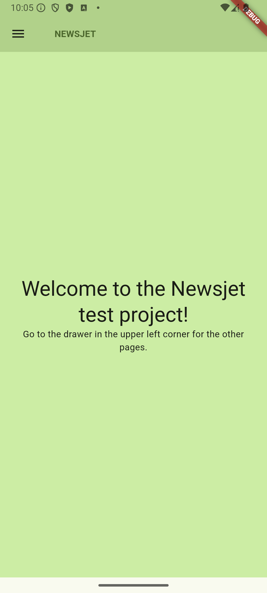
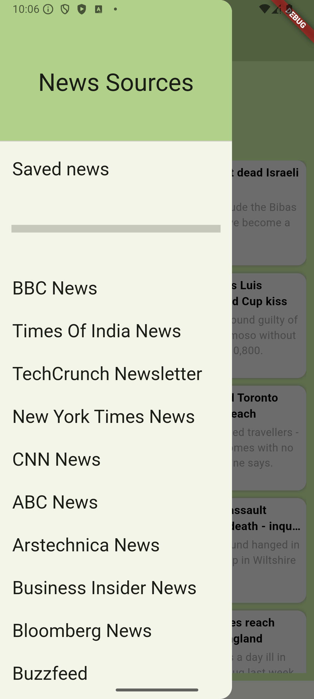

# NEWSJET

Sample flutter project for use of sqflite and the http package for api consumption.

## Description

Mobile app created for querying and saving the latest news articles from various popular sources.

The app makes use of the following main packages:
- [sqflite](https://pub.dev/packages/sqflite) for holding persistent data about saved news articles.
- [http](https://pub.dev/packages/http) to consume the news articles api.
- [any_links_preview](https://pub.dev/packages/any_link_preview) to display cards of article content.
- [url_launcher](https://pub.dev/packages/url_launcher) to take the user directly to the device's default browser to view a selected article link.

The consumed API for this app is [API2NEWS](https://documenter.getpostman.com/view/13902582/2sA3rxrZcC?ref=producthunt?ref=freepublicapis.com#9be4d294-c088-482e-84a8-6afc75aa5099). It provides the most recent articles from more the 10 news sources in json format across various endpoints.

## Screenshots

